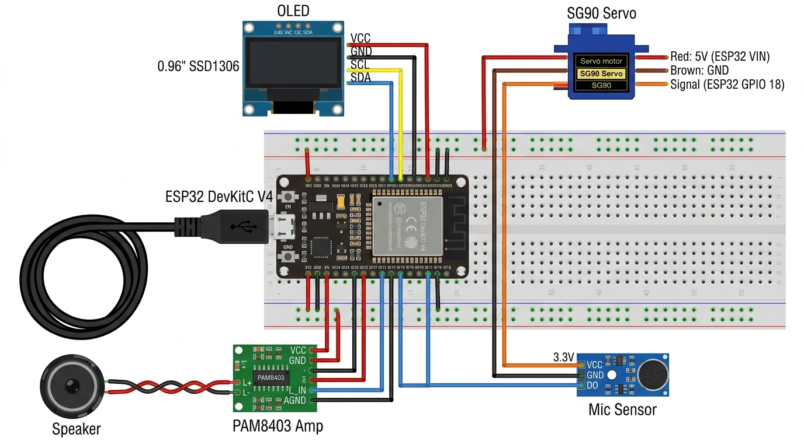

# Interactive Desk Buddy: Hardware Design & Firmware Specification

**Date:** 2026-09-09  
**Author:** Pair Programming Agent & User  
**Target Hardware:** ESP32 DevKit V1/V4, SSD1306 0.96" OLED (I2C), SG90 9g Servo, PAM8403 3W Stereo Amplifier, 15mm 3W Speaker, Sound Detection Microphone Module.  
**Power Source:** Single USB Cable (5V via PC USB port or phone adapter).

---

## 1. Executive Summary & Goals

The **Interactive Desk Buddy** is an animated, voice/sound-reactive robotic tabletop companion. Sitting beside your monitor, it brings life to your workspace with expressive vector eye animations, responsive head tilting and nodding, and procedural R2-D2 style chirps and bleeps generated on-the-fly.

### Core Goals
1. **Expressive Personality:** High-framerate, fluid vector eye animations (blinking, squinting, happy curves, surprised wide eyes) rendered onto a 0.96" SSD1306 OLED display.
2. **Dynamic Sound Reactions:** Listens for sounds (claps, snaps, speech, knocks) via the microphone sensor, immediately turning to face the user, blinking, and chirping in response.
3. **Procedural R2-D2 Audio:** Audio is generated mathematically using the ESP32's built-in 8-bit Digital-to-Analog Converter (DAC). Requires zero external audio files, SD cards, or flash file systems, enabling instantaneous and latency-free responses.
4. **Single-Cable USB Power Safety:** Hardware and firmware power-budgeting guarantees stable operation from a single standard 500mA PC USB port without brownouts, ESP32 resets, or the need for an external battery.
5. **Dual-Core FreeRTOS Architecture:** Decouples the 60 FPS OLED eye rendering from audio generation and servo pulse-width modulation (PWM) easing.

---

## 2. Hardware Wiring & Electrical Interconnects

### 2.1 Breadboard Wiring Diagram
The diagram below illustrates the exact breadboard routing for all five peripheral modules connected to the ESP32:



### 2.2 Complete Pin Connection Matrix

| Peripheral | Pin Name | Wire Color | ESP32 DevKit Pin | Function / Logic Level |
| :--- | :--- | :--- | :--- | :--- |
| **0.96" OLED (SSD1306)** | VCC | Red | **3V3** | 3.3V Logic Power |
| | GND | Black | **GND** | Ground |
| | SCL | Yellow | **GPIO 22** | Hardware I2C Clock |
| | SDA | Blue | **GPIO 21** | Hardware I2C Data |
| **SG90 9g Servo** | VCC | Red | **VIN (5V)** | 5V Power directly from USB rail |
| | GND | Brown / Black | **GND** | Ground |
| | Signal | Orange | **GPIO 18** | LEDC Hardware PWM Signal |
| **PAM8403 Audio Amp** | +5V / VDD | Red | **VIN (5V)** | 5V Power Rail |
| | - / PGND | Black | **GND** | Power Ground |
| | L_IN | Blue / White | **GPIO 25** | ESP32 Internal DAC Channel 1 |
| | L_GND | Black | **GND** | Audio Signal Ground |
| | L+ | Red | **Speaker (+)** | 15mm 3W Speaker Positive Terminal |
| | L- | Black | **Speaker (-)** | ⚠️ **Direct to Speaker Negative (NEVER to GND)** |
| **Sound Sensor Module** | VCC | Red | **3V3** | 3.3V Power |
| | GND | Black | **GND** | Ground |
| | DO | Blue | **GPIO 19** | Digital Sound Spike Trigger (Interrupt capable) |
| | AO (Optional) | Green | **GPIO 34** | Analog Amplitude Input (ADC1_CH6) |

### 2.3 Step-by-Step Device Hookup Sequence

#### Step 1: 0.96" I2C OLED Display (4 Pins)
Connect the display pins directly to the ESP32:
1. **OLED `VCC`** ──▶ **ESP32 `3V3`** (3.3V Power)
2. **OLED `GND`** ──▶ **ESP32 `GND`** (Ground)
3. **OLED `SCL`** ──▶ **ESP32 `GPIO 22`** (I2C Clock)
4. **OLED `SDA`** ──▶ **ESP32 `GPIO 21`** (I2C Data)

#### Step 2: SG90 9g Servo Motor (3 Pins)
Connect the servo plug wires to the ESP32:
1. **Servo Red Wire (`+5V`)** ──▶ **ESP32 `VIN` (or `5V`)** (Direct from USB 5V rail)
2. **Servo Brown or Black Wire (`GND`)** ──▶ **ESP32 `GND`**
3. **Servo Orange or Yellow Wire (`Signal`)** ──▶ **ESP32 `GPIO 18`** (PWM Control)

#### Step 3: PAM8403 Amplifier & 15mm 3W Speaker
First, solder/connect your 15mm speaker directly to the PAM8403 board:
- **Speaker (+) terminal** ──▶ **PAM8403 `L+`**
- **Speaker (-) terminal** ──▶ **PAM8403 `L-`** *(⚠️ Never connect L- to Ground!)*

Next, connect PAM8403 to the ESP32:
1. **PAM8403 `+5V` (VDD)** ──▶ **ESP32 `VIN` (or `5V`)**
2. **PAM8403 `-` (Power GND)** ──▶ **ESP32 `GND`**
3. **PAM8403 `L_IN` (Audio Input)** ──▶ **ESP32 `GPIO 25`** (ESP32 Built-in DAC 1)
4. **PAM8403 `L_GND` (Audio Ground)** ──▶ **ESP32 `GND`**

#### Step 4: Sound Detection Microphone Module (3 Pins)
Connect the sensor module to the ESP32:
1. **Sensor `VCC`** ──▶ **ESP32 `3V3`**
2. **Sensor `GND`** ──▶ **ESP32 `GND`**
3. **Sensor `DO` (Digital Out)** ──▶ **ESP32 `GPIO 19`**
*(Note: Pin `AO` can be left unconnected for standard clap/voice detection).*

### 2.4 Electrical Rules & Precautions
1. **Bridge-Tied Load (BTL) Audio Caution:** The PAM8403 amplifier features balanced BTL outputs. The `L-` terminal carries an inverted active waveform and must **never** be tied to electrical Ground.
2. **Brownout Prevention on Single USB:**
   - The SG90 servo must be fed from the `VIN` (5V) pin, not the ESP32's 3.3V low-dropout (LDO) regulator pin, protecting the ESP32 core logic from voltage sags.
   - Firmware implements smooth sinusoidal easing on servo angular velocity to clamp peak motor starting current below 150mA.
   - Wi-Fi and Bluetooth radios are permanently kept powered down.

---

## 3. Firmware Architecture

```
 ┌────────────────────────────────────────────────────────────────────────┐
 │                              ESP32 MCU                                 │
 │                                                                        │
 │  ┌─────────────────────────────────┐                                  │
 │  │ Core 1: Interaction & Animation │                                  │
 │  │ ------------------------------- │                                  │
 │  │ • Sound Sensor Interrupt / Poll │                                  │
 │  │ • Mood & Emotion State Machine  │                                  │
 │  │ • 60 FPS Procedural Eye Engine  │                                  │
 │  └────────────────┬────────────────┘                                  │
 │                   │ FreeRTOS Queue (Event / Mood Dispatcher)           │
 │                   ▼                                                    │
 │  ┌─────────────────────────────────┐                                  │
 │  │ Core 0: Real-Time Audio & Motion│                                  │
 │  │ ------------------------------- │                                  │
 │  │ • Procedural DAC Synth (R2-D2)  │                                  │
 │  │ • Eased Servo Stepper (LEDC)    │                                  │
 │  └─────────────────────────────────┘                                  │
 └────────────────────────────────────────────────────────────────────────┘
```

### 3.1 Task Scheduling
- **Task 1: `vAnimationTask` (Pinned to Core 1, Priority 2):**
  Renders rounded vector eyes, pupil tracking coordinates, eyelid droop, and state transitions to the SSD1306 display via I2C at ~50–60 FPS.
- **Task 2: `vSoundMotionTask` (Pinned to Core 0, Priority 3):**
  Awaits sound trigger events or state updates via `xEventQueue`. Synthesizes audio waveforms directly on DAC1 (GPIO 25) with zero jitter and updates servo target angles with cubic ease-in/out increments every 20ms.

---

## 4. Subsystems Detail

### 4.1 Procedural Vector Eye Engine (`DisplayController`)
Instead of loading static bitmap arrays into flash, the eye engine procedurally calculates shapes using primitives (`drawCircle`, `drawDisc`, `drawBox`, `drawRoundRect`):
- **Normal Idle:** Two soft rounded rectangles with subtle inner pupils. Glances left, center, right at randomized intervals (2 to 5 seconds). Periodic natural double-blinks.
- **Triggered / Curious:** Pupils expand, one eyebrow slightly arches or tilts 15 degrees.
- **Happy / Laughing:** Eyes deform into upward-curved crescent arcs (`^  ^`).
- **Surprised:** Eyes expand into large open circles (`O  O`).
- **Sleepy / Low Power:** Eyelids droop over 70% of the eye area; slow floating "Zzz" icons drift across the screen after 2 minutes of silence.

### 4.2 Procedural Audio Synthesizer (`AudioSynth`)
Uses ESP32's built-in 8-bit DAC on GPIO 25. Tones are generated using frequency-modulated sine/triangular waveforms with envelope shaping:
- **`CHIRP_CURIOUS`:** Fast frequency sweep upwards from 1.2 kHz to 2.8 kHz with slight vibrato (duration: 120ms).
- **`CHIRP_HAPPY`:** Staccato 4-note ascending arpeggio with randomized pitch inflection (R2-D2 excitement).
- **`CHIRP_SQUEAK`:** Short, high-pitch 3.5 kHz chirp followed by a quick pitch drop.
- **`CHIRP_POWER_DOWN`:** Descending slow glide from 1.5 kHz down to 300 Hz.
- **Gain Capping:** Digital amplitude is clamped between 0 and 96 (out of 255) to maintain crystal clear sound without clipping or high current draw.

### 4.3 Low-Current Servo Motion Controller (`ServoController`)
- **LEDC Peripheral:** Uses ESP32's built-in LEDC timer (50 Hz, 16-bit resolution).
- **Target vs. Current Angle:** Moves the servo in micro-steps toward `targetAngle` using smooth cubic easing:
  $$\Delta \theta = (\text{targetAngle} - \text{currentAngle}) \times \text{easingFactor}$$
- **Angle Range Constraints:** Hardware limits set between 30° and 150° (90° centered) to avoid physical strain on the servo mechanism.

### 4.4 Sound Sensor & Event Debouncing (`SoundSensor`)
- Reads the digital trigger pin `DO` (GPIO 19).
- Debounces trigger events with a 150ms lockout window to prevent false double-triggers from the buddy's own audio chirps.
- Multi-trigger pattern detection:
  - **Single Sound (within 500ms):** Curious glance + curious chirp.
  - **Double Clap (2 spikes within 600ms):** Triggers Happy Dance mode (head wiggle + happy arpeggio).
  - **Sustained Loud Noise:** Surprised reaction.

---

## 5. Project Directory Structure

```
Desk buddy/
├── platformio.ini              # PlatformIO environment with library dependencies
├── docs/
│   ├── circuit_diagram.jpg     # Generated breadboard schematic image
│   └── superpowers/specs/
│       └── 2026-09-09-interactive-desk-buddy-design.md
└── src/
    ├── main.cpp                # App entry point, FreeRTOS task spawns, and event loops
    ├── config.h                # Hardware pinouts, timing constants, and calibration values
    ├── DisplayController.h     # SSD1306 vector eye animation engine
    ├── DisplayController.cpp
    ├── AudioSynth.h            # Procedural R2-D2 DAC frequency generator
    ├── AudioSynth.cpp
    ├── ServoController.h       # Non-blocking eased servo motion controller
    ├── ServoController.cpp
    ├── SoundSensor.h           # Debounced microphone listener & clap classifier
    └── SoundSensor.cpp
```

### Dependencies
- **Adafruit SSD1306** (`^2.5.7`) & **Adafruit GFX Library** (`^1.11.5`) — for fast OLED rendering.
- **ESP32 Arduino Core** (`espressif32`) — built-in FreeRTOS, DAC, and LEDC PWM support.

---

## 6. Verification & Test Plan

1. **Phase 1: Breadboard & Power Verification**
   - Connect ESP32 to USB; measure 5V rail and 3.3V rail with a multimeter (or check power LEDs).
   - Verify that sensor, OLED, servo, and amp power LEDs turn on without brownout.
2. **Phase 2: Individual Subsystem Verification**
   - **OLED Test:** Run a test frame to ensure I2C address (`0x3C`) responds and eyes render.
   - **Audio Test:** Trigger a soft 1 kHz test chirp on GPIO 25 to verify PAM8403 and speaker.
   - **Servo Test:** Sweep 45° to 135° to check smooth rotation and center alignment at 90°.
   - **Sensor Test:** Adjust the blue trimpot on the sound sensor until the trigger LED responds reliably to a finger snap or hand clap.
3. **Phase 3: End-to-End Interaction Test**
   - Single clap: desk buddy perks up, faces center, displays curious wide eyes, and chirps.
   - Double clap: triggers happy wiggly motion and joyful R2-D2 melody.
   - Idle timeout (10s): returns to gentle looking around and occasional soft blinks.
